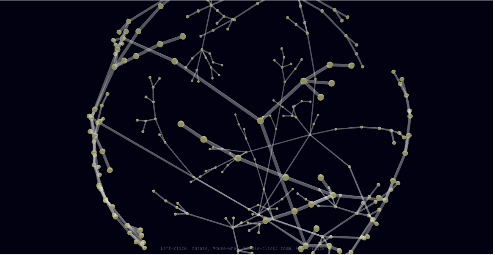

# UltraTerrestrial

**Tracking the State of Disclosure**
*Striving to document, explore and disseminate the past, present and future of the UFO topic and its bearing on humanity, the universe and our place within it.*

---

## Tech Stack

**Xata**

**Supabase**

[Cheatsheet](https://supabase.com/dashboard/project/oylaiyodggkrghjkbruy/api?resource=event_topic_link)
[GraphiQL](https://supabase.com/dashboard/project/oylaiyodggkrghjkbruy/api/graphiql)

**N8N** *(Running locally)*

1. Docker (<https://docs.n8n.io/hosting/installation/docker/#next-steps>)

```
docker volume create n8n_data

docker run -it --rm --name n8n -p 5678:5678 -v n8n_data:/home/node/.n8n docker.n8n.io/n8nio/n8n
```

2. With Postgres

```
docker volume create n8n_data

docker run -it --rm \
 --name n8n \
 -p 5678:5678 \
 -e DB_TYPE=postgresdb \
 -e DB_POSTGRESDB_DATABASE=<POSTGRES_DATABASE> \
 -e DB_POSTGRESDB_HOST=<POSTGRES_HOST> \
 -e DB_POSTGRESDB_PORT=<POSTGRES_PORT> \
 -e DB_POSTGRESDB_USER=<POSTGRES_USER> \
 -e DB_POSTGRESDB_SCHEMA=<POSTGRES_SCHEMA> \
 -e DB_POSTGRESDB_PASSWORD=<POSTGRES_PASSWORD> \
 -v n8n_data:/home/node/.n8n \
 docker.n8n.io/n8nio/n8n
 ```

**Airtable**

[Subject Matter Expert Form](https://airtable.com/appN3js5xinc0L7ln/paggeZBJoI9CJWw2o/form)
[Docs](https://airtable.com/appN3js5xinc0L7ln/api/docs#javascript/metadata)

<https://developers.facebook.com/apps/383699827904694/webhooks/>

## Visualizations

## Features

### Live Collaboration

<https://liveblocks.io/docs/tools/nextjs-starter-kit>
<https://livekit.io/?ref=therundown>

## UI/3D



- [3D Graph On A Sphere](https://observablehq.com/@fil/3d-graph-on-sphere)

<https://github.com/NASA-AMMOS/3DTilesRendererJS>

**ReactFlow + D3**
<https://github.com/abdulmajeed33/d3-force-network-visualization/tree/main>

[D3 Tree Diagram](https://observablehq.com/@d3/tree/2?intent=fork)

<https://github.com/lewhunt/divz>
<https://github.com/lewhunt/divz>
<https://codesandbox.io/p/sandbox/camera-scroll-tu24h?file=%2Fsrc%2FModel.js>
<https://github.com/pmndrs/uikit>
<https://twitter.com/odayibasi>
<https://youtu.be/pR5XSg0BgyE>"
<https://youtu.be/pR5XSg0BgyE>
<https://youtu.be/Cruarl4ES_s>
<https://youtu.be/ZiiMyzXWmkQ>
<https://youtu.be/UbR1j0pbA1s>
<https://youtu.be/X78kt7U4VCs>

**Mapbox WebGL**
<https://deck.gl/>

# Features

[Deepgram: AI Speech Integration](https://github.com/deepgram)

[Tavily AI Search API](https://docs.tavily.com/docs/tavily-api/introduction)

[CoPIlotKit: Custom AI Copilots](https://github.com/CopilotKit/CopilotKit)

OPenAI Integrated with NextJS Logs
<https://github.com/whoiskatrin/npm-copilot>

<https://app.eraser.io/workspace/ifOFwdSYj9tNbIpTEZ0R>

<https://bg.ibelick.com/>
<https://www.tailwindcss-animated.com/configurator.html>

React + Mind Map UI + ThreeJS: <https://dev.to/pahund/drawing-a-mind-map-with-three-js-and-react-nuffshell-coding-diary-part-i-1g6n>

### Additional 3D Graph Options

<https://github.com/uber/react-vis-force/tree/master>
<https://github.com/anvaka/VivaGraphJS>
<https://github.com/anvaka/ngraph.pixel>

<https://github.com/vasturiano/three-forcegraph?tab=readme-ov-file>

[COBE](https://cobe.vercel.app/docs)
<https://www.youtube.com/watch?v=EvgdirLeYaQ&ab_channel=UsmanAbdurRehman>
<https://github.com/xyflow/xyflow/discussions/3764>

<https://medium.com/frontend-development-with-js/visualization-reactflow-samples-cd454557ebb1>
<https://github.com/danielcaldas/react-d3-graph>
<https://github.com/builduilabs/2023-09-10-animated-list-recipe/blob/main/app/page.tsx>

<https://cloud.tiptap.dev/pro-extensions>
