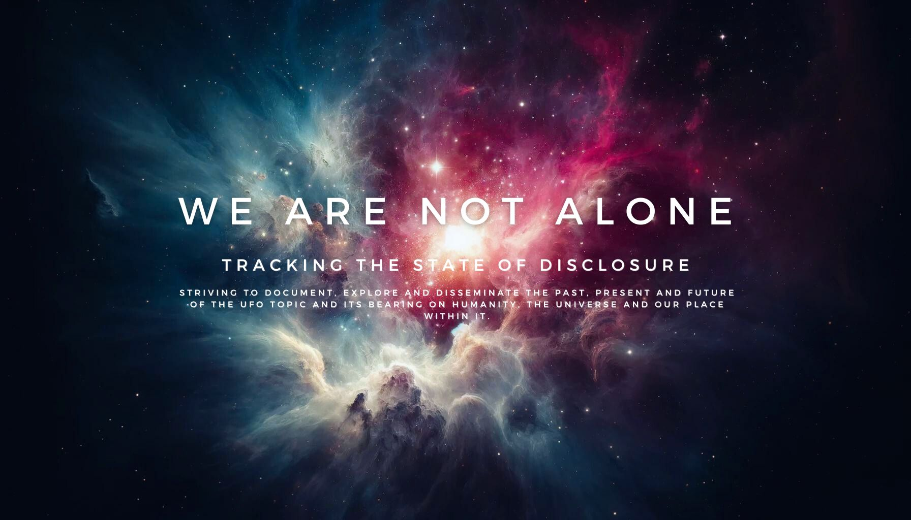

# UltraTerrestrial

**Tracking the State of Disclosure**
*Striving to document, explore and disseminate the past, present and future of the UFO topic and its bearing on humanity, the universe and our place within it.*

---

## Tech Stack

**Sanity CMS**

---

**Supabase**

[Cheatsheet](https://supabase.com/dashboard/project/oylaiyodggkrghjkbruy/api?resource=event_topic_link)
[GraphiQL](https://supabase.com/dashboard/project/oylaiyodggkrghjkbruy/api/graphiql)

---

**ReactFlow + D3**

<https://github.com/abdulmajeed33/d3-force-network-visualization/tree/main>

[D3 Tree Diagram](https://observablehq.com/@d3/tree/2?intent=fork)

---

**Local Dev**

### Airtable

[Subject Matter Expert Form](https://airtable.com/appN3js5xinc0L7ln/paggeZBJoI9CJWw2o/form)
[Docs](https://airtable.com/appN3js5xinc0L7ln/api/docs#javascript/metadata)

<https://developers.facebook.com/apps/383699827904694/webhooks/>

### Vector Store OpenAI Assistant File List
 
- [Bob Lazar Interview 1989](Bob-Lazar-Interview-1989.md) - 4/28/2024, 7:06 PM
- [unclassified-2022-annual-report-uap](unclassified-2022-annual-report-uap.pdf) - 4/24/2024, 6:25 AM
- [CIA-RDP96-00788R001700210016-5](CIA-RDP96-00788R001700210016-5.pdf) - 4/24/2024, 6:25 AM
- [DOPSR-CLEARED-508-COMPLIANT](DOPSR-CLEARED-508-COMPLIANT.pdf) - 4/24/2024, 6:16 AM
- [TheUFOPhenomenon](TheUFOPhenomenon.txt) - 4/24/2024, 6:16 AM
- [Subcommittee on National Security](Subcommittee-on-National-Security.txt) - 4/24/2024, 6:16 AM
- [AARO_DHS_Kona_Blue](AARO_DHS_Kona_Blue.pdf) - 4/24/2024, 6:16 AM
- [podcast-episode-1-transcript](podcast-episode-1-transcript.md) - 4/24/2024, 6:16 AM
- [Joe Rogan Experience #1315 - Bob Laz](Joe-Rogan-Experience-1315-Bob-Laz.md) - 4/24/2024, 6:08 AM
- [rogan 2028 - knapp & corbell](rogan-2028-knapp-corbell.txt) - 4/24/2024, 6:08 AM
- [The UFO Reporter Part 1: The Files o.sty](The-UFO-Reporter-Part-1-The-Files-o.sty.txt) - 4/24/2024, 6:08 AM
- [david-grusch-joe-rogan](david-grusch-joe-rogan.txt) - 4/24/2024, 6:08 AM
- [David Fravor: UFOs, Aliens, Fighter](David-Fravor-UFOs-Aliens-Fighter.txt) - 4/24/2024, 6:08 AM
- [The UFO Reporter Part 2: The Files o.sty](The-UFO-Reporter-Part-2-The-Files-o.sty.txt) - 4/24/2024, 6:08 AM
- [Joe Rogan Experience #1361 - Cmdr.sty](Joe-Rogan-Experience-1361-Cmdr.sty.txt) - 4/24/2024, 6:08 AM
- [Transcript of #1510 - George Knapp & ... _ Happy Scribe](Transcript-of-1510-George-Knapp-Happy-Scribe.pdf) - 4/24/2024, 6:08 AM
- [Cold War UFOs - Keith Mitchell](Cold-War-UFOs-Keith-Mitchell.txt) - 4/24/2024, 6:08 AM
- [ufo6](ufo6.pdf) - 4/24/2024, 6:08 AM
- [ufo3](ufo3.pdf) - 4/24/2024, 6:08 AM
- [sgp.fas.org-CIAs Role in the Study of UFOs 1947-90](sgp.fas.org-CIAs-Role-in-the-Study-of-UFOs-1947-90.pdf) - 4/24/2024, 6:08 AM
- [ufo5](ufo5.pdf) - 4/24/2024, 6:08 AM
- [ufo9](ufo9.pdf) - 4/24/2024, 6:08 AM
- [livescience.com-Flying saucers to mind control 24 declassified military CIA secrets](livescience.com-Flying-saucers-to-mind-control-24-declassified-military-CIA-secrets.pdf) - 4/24/2024, 6:08 AM
- [bluebook](bluebook.pdf) - 4/24/2024, 6:08 AM
- [ufo13](ufo13.pdf) - 4/24/2024, 6:08 AM
- [roswell](roswell.pdf) - 4/24/2024, 6:08 AM
- [john.lear.letter](john.lear.letter.pdf) - 4/24/2024, 6:06 AM
- [Prelimary-Assessment-UAP-20210625](Prelimary-Assessment-UAP-20210625.pdf) - 4/24/2024, 6:06 AM
- [roswell](roswell.pdf) - 4/24/2024, 6:06 AM
