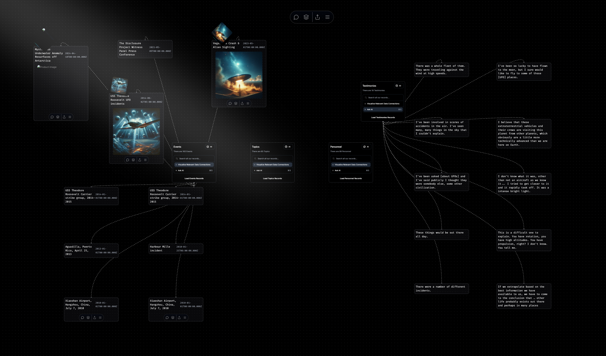

# UltraTerrestrial

**Tracking the State of Disclosure**
_Striving to document, explore and disseminate the past, present and future of the UFO topic and its bearing on humanity, the universe and our place within it._

---

[AI](./docs/ai/ai.md)

[Notes](./docs/notes.md)

Pitch?:

At its core, Ultraterrestrial is designed to chronicle major historical UFO events with stunning 3D visuals that map sightings across the globe. Picture an interactive world map where you can zoom in and out, explore sightings by location, and navigate through time using a dynamic slider that showcases how these phenomena have evolved over the decades. Heatmaps will highlight regions with high densities of sightings, and for those who love immersive experiences, augmented reality features will let you visualize historical sightings in your current surroundings.

Each event isn’t just a pinpoint on a map; it comes alive with detailed descriptions, eyewitness accounts, official reports, and multimedia elements like photos, videos, and audio recordings. Users can dive deep into geospatial data, view satellite imagery, and even add their own annotations, making the exploration both informative and interactive.

Keeping up with the latest developments is crucial, and Ultraterrestrial excels in status reporting on claims, hearings, news items, and events. A real-time dashboard offers an overview of recent developments, ongoing investigations, and upcoming events. Imagine visual timelines tracking the progression of key claims and hearings, complemented by a notification system that keeps you updated on specific topics or events you care about most.

One of the standout features is the Topic Tracker. This dynamic tool maps out interconnected topics using network graphs, highlighting trending subjects and organizing them into subtopics for easy navigation. Users can engage in discussions, participate in polls, and contribute their own insights, fostering a vibrant community of like-minded individuals.

No comprehensive platform would be complete without a Who’s Who roster, and Ultraterrestrial delivers with detailed profiles of key figures in the UFO disclosure space. From Bob Lazar to Jeremy Corbell, each profile includes biographies, contributions, claims, and multimedia content like interviews and documentaries. An interactive network map shows how these figures connect with each other, organizations, and major events, providing a clear picture of the landscape.

For those who crave deeper investigation, Ultraterrestrial offers an Investigative Hub. Think of it as a central place where you can follow complex threads weaving through various events, people, and evidence. Interactive diagrams and mind maps make it easy to visualize these connections, while in-depth case studies allow for thorough exploration of specific phenomena or incidents. Users can collaborate on investigations, contribute findings, and even participate in verifying information to ensure credibility.

The Library is another cornerstone of Ultraterrestrial, housing major documents, letters, artifacts, and evidence in a meticulously organized digital repository. With features like document scanning, OCR, and detailed metadata, users can easily search and access a wealth of information. Interactive exhibits and guided tours provide curated experiences, making the library both a resource and an educational tool.

Addressing the big questions is essential, and Ultraterrestrial presents an official list of “unanswered questions” along with their implications. These questions are categorized by themes such as technology, origin, and intent, and each one links to relevant people, places, and events. Users can track the progress of these questions, submit new ones, and vote on which should be prioritized, ensuring that the platform remains dynamic and responsive to community interests.

When it comes to the more mysterious aspects, Ultraterrestrial includes lists of suspected “black” bases and contractors involved in retrieving materials. Interactive maps provide detailed location data, while base profiles offer background information, theories, sightings, and photographic evidence. Contractor profiles document affiliations and evidence linking them to retrieved materials, complete with network mapping to show connections to various bases and events.

But Ultraterrestrial doesn’t stop at just providing information—it’s built to engage and empower its users. With community features like user accounts, profiles, forums, and user-generated content, the platform fosters a sense of belonging and collaboration. Users can upload their own sightings, participate in collaborative investigations, and contribute to the growing tapestry of ultraterrestrial knowledge.

Multimedia integration takes Ultraterrestrial to the next level, offering a rich video library with documentaries, interviews, and user-submitted footage. Exclusive podcasts and audio archives provide another layer of content, ensuring there’s always something new and engaging to explore.

Education is a key component, with interactive learning modules, quizzes, and expert webinars that help users deepen their understanding of UFO phenomena. Data analytics and insights offer trend analysis and predictive modeling, giving users a sophisticated toolset to interpret the vast amounts of data available.

Ultraterrestrial also emphasizes accessibility and inclusivity, supporting multiple languages and regional customization to reach a global audience. The platform is designed with accessibility in mind, featuring screen reader compatibility, keyboard navigation, and customizable UI options to ensure everyone can engage with the content comfortably.

Security and privacy are paramount. Ultraterrestrial employs robust data protection measures, giving users control over their information and offering anonymity options for those who prefer it. The platform is built on a scalable technical stack, ensuring it can handle large volumes of data and high traffic as the community grows.

To sustain its mission, Ultraterrestrial employs diverse monetization strategies, including a freemium model with premium subscriptions, donations, crowdfunding, and merchandise sales. Transparent financial practices and scalable infrastructure ensure the platform remains reliable and trustworthy.

Launching Ultraterrestrial involves strategic marketing and community-building efforts, leveraging social media campaigns, influencer partnerships, and content marketing to attract and retain users. Legal and ethical considerations are addressed through strict content moderation, intellectual property compliance, and adherence to data privacy regulations.

In summary, Ultraterrestrial is poised to become the leading platform in the UFO disclosure space, offering a rich, interactive, and comprehensive experience that not only informs but also engages and empowers its users. Whether you’re an avid enthusiast, a dedicated researcher, or just curious about the mysteries of the skies, Ultraterrestrial provides the tools and community to explore the fascinating world of ultraterrestrial phenomena.
