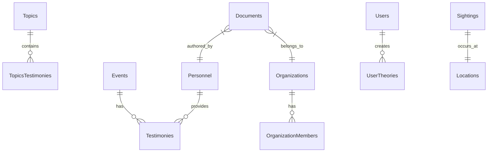

**3.5 Sonnet**
Based on the provided schema.json, I'll analyze the structure and provide recommendations for optimization. Let me break this down into key components:

1. **Core Entities**:


Key Observations and Recommendations:

1. **Data Normalization**:
   - The schema properly implements junction tables for many-to-many relationships
   - Good use of linking tables for user saved items
   - Vector embeddings for AI-related features in documents and mindmaps

2. **Suggested Improvements**:

```sql
-- Add missing indices
ALTER TABLE events ADD INDEX idx_date (date);
ALTER TABLE sightings ADD INDEX idx_date (date);
ALTER TABLE documents ADD INDEX idx_date (date);

-- Add timestamps for auditing
ALTER TABLE topics ADD COLUMN created_at TIMESTAMP DEFAULT CURRENT_TIMESTAMP;
ALTER TABLE topics ADD COLUMN updated_at TIMESTAMP DEFAULT CURRENT_TIMESTAMP ON UPDATE CURRENT_TIMESTAMP;

-- Add soft delete capability
ALTER TABLE topics ADD COLUMN deleted_at TIMESTAMP NULL;
ALTER TABLE events ADD COLUMN deleted_at TIMESTAMP NULL;
```

3. **Suggested Additional Constraints**:
```sql
-- Add check constraints for ratings
ALTER TABLE personnel ADD CONSTRAINT chk_credibility 
    CHECK (credibility BETWEEN 0 AND 100);
ALTER TABLE personnel ADD CONSTRAINT chk_authority 
    CHECK (authority BETWEEN 0 AND 100);

-- Add geographical constraints
ALTER TABLE locations ADD CONSTRAINT chk_latitude 
    CHECK (latitude BETWEEN -90 AND 90);
ALTER TABLE locations ADD CONSTRAINT chk_longitude 
    CHECK (longitude BETWEEN -180 AND 180);
```

4. **Security Enhancements**:
```sql
-- Add role-based access control
CREATE TABLE user_roles (
    user_id INT REFERENCES users(id),
    role ENUM('admin', 'editor', 'viewer'),
    PRIMARY KEY (user_i[Anthropic Server Error] overloaded_error: Overloaded

**GPT 4o**
Based on the provided JSON schema, I'll evaluate and refine the database architecture. The schema outlines a complex system with multiple entities and relationships. Below is a revised schema that reflects the structure and relationships defined in your JSON schema.

### Key Considerations
1. **Primary Keys**: Each table should have a unique identifier, typically an `id` column using `SERIAL` or `UUID`.
2. **Foreign Keys**: Establish relationships using foreign keys based on the `revLinks` and `link` attributes.
3. **Data Types**: Convert JSON types to SQL equivalents.
4. **Indexing**: Consider indexing columns that are frequently queried or used in joins.

### Revised Database Schema

```sql
-- Topics Table
CREATE TABLE Topics (
    topic_id SERIAL PRIMARY KEY,
    name VARCHAR(255),
    summary TEXT,
    photo VARCHAR(255), -- Assuming file paths or URLs
    photos TEXT[], -- Array of file paths or URLs
    title VARCHAR(255) UNIQUE
);

-- Personnel Table
CREATE TABLE Personnel (
    personnel_id SERIAL PRIMARY KEY,
    bio TEXT,
    role VARCHAR(255),
    facebook VARCHAR(255),
    twitter VARCHAR(255),
    website VARCHAR(255),
    instagram VARCHAR(255),
    photos TEXT[], -- Array of file paths or URLs
    rank INT,
    credibility INT,
    popularity INT,
    name VARCHAR(255) UNIQUE,
    authority INT
);

-- Events Table
CREATE TABLE Events (
    event_id SERIAL PRIMARY KEY,
    name TEXT,
    description TEXT,
    location VARCHAR(255),
    latitude FLOAT,
    longitude FLOAT,
    event_date TIMESTAMP,
    photos TEXT[], -- Array of file paths or URLs
    metadata JSONB DEFAULT '{}',
    title VARCHAR(255) UNIQUE,
    summary TEXT
);

-- Organizations Table
CREATE TABLE Organizations (
    organization_id SERIAL PRIMARY KEY,
    name VARCHAR(255),
    specialization VARCHAR(255),
    description TEXT,
    photo VARCHAR(255),
    image VARCHAR(255), -- Assuming file paths or URLs
    title VARCHAR(255) UNIQUE
);

-- Sightings Table
CREATE TABLE Sightings (
    sighting_id SERIAL PRIMARY KEY,
    date TIMESTAMP,
    description VARCHAR(255),
    media_link VARCHAR(255),
    city VARCHAR(255),
    state VARCHAR(255),
    country VARCHAR(255),
    shape VARCHAR(255),
    duration_seconds VARCHAR(255),
    duration_hours_min VARCHAR(255),
    comments VARCHAR(255),
    date_posted TIMESTAMP,
    latitude FLOAT,
    longitude FLOAT
);

-- Event-Subject-Matter-Experts Table
CREATE TABLE EventSubjectMatterExperts (
    event_id INTEGER REFERENCES Events(event_id),
    expert_id INTEGER REFERENCES Personnel(personnel_id),
    PRIMARY KEY (event_id, expert_id)
);

-- Topic-Subject-Matter-Experts Table
CREATE TABLE TopicSubjectMatterExperts (
    topic_id INTEGER REFERENCES Topics(topic_id),
    expert_id INTEGER REFERENCES Personnel(personnel_id),
    PRIMARY KEY (topic_id, expert_id)
);

-- Organization-Members Table
CREATE TABLE OrganizationMembers (
    member_id INTEGER REFERENCES Personnel(personnel_id),
    organization_id INTEGER REFERENCES Organizations(organization_id),
    PRIMARY KEY (member_id, organization_id)
);

-- Testimonies Table
CREATE TABLE Testimonies (
    testimony_id SERIAL PRIMARY KEY,
    claim TEXT,
    event_id INTEGER REFERENCES Events(event_id),
    summary TEXT,
    witness_id INTEGER REFERENCES Personnel(personnel_id),
    documentation TEXT[], -- Array of file paths or URLs
    testimony_date TIMESTAMP,
    organization_id INTEGER REFERENCES Organizations(organization_id),
    source TEXT,
    media TEXT[], -- Array of file paths or URLs
    context TEXT
);

-- Topics-Testimonies Table
CREATE TABLE TopicsTestimonies (
    topic_id INTEGER REFERENCES Topics(topic_id),
    testimony_id INTEGER REFERENCES Testimonies(testimony_id),
    PRIMARY KEY (topic_id, testimony_id)
);

-- Documents Table
CREATE TABLE Documents (
    document_id SERIAL PRIMARY KEY,
    files TEXT[], -- Array of file paths or URLs
    summary TEXT,
    embedding VECTOR(1536),
    title VARCHAR(255),
    document_date TIMESTAMP,
    author_id INTEGER REFERENCES Personnel(personnel_id),
    organization_id INTEGER REFERENCES Organizations(organization_id),
    url TEXT
);

-- Locations Table
CREATE TABLE Locations (
    location_id SERIAL PRIMARY KEY,
    name VARCHAR(255),
    coordinates VARCHAR(255),
    google_maps_location_id TEXT,
    city VARCHAR(255),
    state VARCHAR(255),
    latitude FLOAT,
    longitude FLOAT
);

-- Event-Topic-Subject-Matter-Experts Table
CREATE TABLE EventTopicSubjectMatterExperts (
    event_id INTEGER REFERENCES Events(event_id),
    topic_id INTEGER REFERENCES Topics(topic_id),
    expert_id INTEGER REFERENCES Personnel(personnel_id),
    PRIMARY KEY (event_id, topic_id, expert_id)
);

-- Users Table
CREATE TABLE Users (
    user_id SERIAL PRIMARY KEY,
    email VARCHAR(255) UNIQUE,
    name VARCHAR(255),
    photo VARCHAR(255), -- Assuming file paths or URLs
    profile_image_url VARCHAR(255),
    external_id VARCHAR(255)
);

-- User-Saved-Events Table
CREATE TABLE UserSavedEvents (
    user_id INTEGER REFERENCES Users(user_id),
    event_id INTEGER REFERENCES Events(event_id),
    theory_id INTEGER REFERENCES UserTheories(theory_id),
    note TEXT,
    note_title VARCHAR(255),
    PRIMARY KEY (user_id, event_id)
);

-- User-Saved-Topics Table
CREATE TABLE UserSavedTopics (
    user_id INTEGER REFERENCES Users(user_id),
    topic_id INTEGER REFERENCES Topics(topic_id),
    theory_id INTEGER REFERENCES UserTheories(theory_id),
    note TEXT,
    note_title VARCHAR(255),
    PRIMARY KEY (user_id, topic_id)
);

-- User-Saved-Key-Figure Table
CREATE TABLE UserSavedKeyFigure (
    user_id INTEGER REFERENCES Users(user_id),
    key_figure_id INTEGER REFERENCES Personnel(personnel_id),
    theory_id INTEGER REFERENCES UserTheories(theory_id),
    note TEXT,
    note_title VARCHAR(255),
    PRIMARY KEY (user_id, key_figure_id)
);

-- User-Saved-Testimonies Table
CREATE TABLE UserSavedTestimonies (
    user_id INTEGER REFERENCES Users(user_id),
    testimony_id INTEGER REFERENCES Testimonies(testimony_id),
    theory_id INTEGER REFERENCES UserTheories(theory_id),
    note TEXT,
    note_title VARCHAR(255),
    PRIMARY KEY (user_id, testimony_id)
);

-- User-Saved-Documents Table
CREATE TABLE UserSavedDocuments (
    user_id INTEGER REFERENCES Users(user_id),
    document_id INTEGER REFERENCES Documents(document_id),
    theory_id INTEGER REFERENCES UserTheories(theory_id),
    note TEXT,
    note_title VARCHAR(255),
    PRIMARY KEY (user_id, document_id)
);

-- User-Theories Table
CREATE TABLE UserTheories (
    theory_id SERIAL PRIMARY KEY,
    user_id INTEGER REFERENCES Users(user_id),
    name VARCHAR(255),
    content TEXT,
    synopsis TEXT,
    diagrams TEXT[] -- Array of file paths or URLs
);

-- User-Saved-Organizations Table
CREATE TABLE UserSavedOrganizations (
    user_id INTEGER REFERENCES Users(user_id),
    organization_id INTEGER REFERENCES Organizations(organization_id),
    theory_id INTEGER REFERENCES UserTheories(theory_id),
    note TEXT,
    note_title VARCHAR(255),
    PRIMARY KEY (user_id, organization_id)
);

-- User-Saved-Sightings Table
CREATE TABLE UserSavedSightings (
    user_id INTEGER REFERENCES Users(user_id),
    sighting_id INTEGER REFERENCES Sightings(sighting_id),
    theory_id INTEGER REFERENCES UserTheories(theory_id),
    note TEXT,
    note_title VARCHAR(255),
    PRIMARY KEY (user_id, sighting_id)
);

-- Tags Table
CREATE TABLE Tags (
    tag_id SERIAL PRIMARY KEY
    -- Define columns as needed
);

-- Theories Table
CREATE TABLE Theories (
    theory_id SERIAL PRIMARY KEY
    -- Define columns as needed
);

-- Mindmaps Table
CREATE TABLE Mindmaps (
    mindmap_id SERIAL PRIMARY KEY,
    json_data JSONB DEFAULT '{}',
    embedding VECTOR(1536),
    user_id INTEGER REFERENCES Users(user_id),
    file VARCHAR(255) -- Assuming file paths or URLs
);

-- Artifacts Table
CREATE TABLE Artifacts (
    artifact_id SERIAL PRIMARY KEY,
    name VARCHAR(255) UNIQUE,
    description TEXT,
    photos TEXT[], -- Array of file paths or URLs
    artifact_date VARCHAR(255),
    source TEXT,
    origin TEXT,
    images TEXT[] -- Array of file paths or URLs
);

-- Case-Files Table
CREATE TABLE CaseFiles (
    case_file_id SERIAL PRIMARY KEY
    -- Define columns as needed
);
```

### Key Points
- **File Handling**: Assumed file paths or URLs for file columns.
- **Array Handling**: Used PostgreSQL's array type for fields like `photos` and `images`.
- **JSON and Vector Types**: Used PostgreSQL's JSONB and VECTOR types for flexible data storage.
- **Link Tables**: Created link tables for many-to-many relationships based on `revLinks`.

This schema provides a relational structure that aligns with your JSON schema while ensuring data integrity and efficient querying. Let me know if you need further adjustments or explanations!

**Groq**
The provided schema defines a complex database structure with multiple tables and relationships. Here's a high-level overview of the schema and some suggestions for improvement:

**Tables:**

1. **topics**: A collection of topics with metadata (name, summary, photo, etc.)
2. **personnel**: A collection of personnel with metadata (bio, role, social media links, etc.)
3. **events**: A collection of events with metadata (name, description, location, date, etc.)
4. **organizations**: A collection of organizations with metadata (name, specialization, description, etc.)
5. **sightings**: A collection of sightings with metadata (date, description, location, etc.)
6. **testimonies**: A collection of testimonies with metadata (claim, event, witness, etc.)
7. **documents**: A collection of documents with metadata (title, summary, author, etc.)
8. **locations**: A collection of locations with metadata (name, coordinates, etc.)
9. **event-topic-subject-matter-experts**: A junction table connecting events, topics, and personnel
10. **user-saved-events**, **user-saved-topics**, **user-saved-key-figure**, **user-saved-testimonies**, **user-saved-documents**, **user-saved-organizations**, **user-saved-sightings**: Junction tables connecting users with various entities (events, topics, personnel, etc.)
11. **user-theories**: A collection of theories with metadata (name, content, synopsis, diagrams, etc.)
12. **mindmaps**: A collection of mindmaps with metadata (json, embedding, user, file, etc.)
13. **artifacts**: A collection of artifacts with metadata (name, description, photos, date, source, origin, images, etc.)
14. **tags**: An empty table (no metadata defined)
15. **theories**: An empty table (no metadata defined)
16. **case-files**: An empty table (no metadata defined)

**Relationships:**

The schema defines various relationships between tables, including:

* Many-to-many relationships between events and personnel (event-topic-subject-matter-experts)
* Many-to-many relationships between topics and personnel (topic-subject-matter-experts)
* Many-to-many relationships between events and topics (event-topic-subject-matter-experts)
* Many-to-many relationships between users and various entities (user-saved-events, user-saved-topics, etc.)
* One-to-many relationships between personnel and testimonies (testimonies)
* One-to-many relationships between events and testimonies (testimonies)
* One-to-many relationships between organizations and testimonies (testimonies)
* One-to-many relationships between personnel and documents (documents)

**Suggestions:**

1. **Consistency:** Ensure that all tables have a consistent naming convention (e.g., singular or plural nouns).
2. **Normalization:** Review the schema to ensure that it is normalized (e.g., avoid duplicate data, use junction tables for many-to-many relationships).
3. **Indexing:** Consider adding indexes to frequently queried columns to improve performance.
4. **Constraints:** Ensure that all tables have proper constraints (e.g., primary keys, foreign keys, unique constraints).
5. **Data types:** Review the data types used in the schema to ensure that they are suitable for the data being stored (e.g., use a specific data type for dates).
6. **Empty tables:** Remove empty tables (tags, theories, case-files) to reduce clutter and improve data consistency.
7. **Junction tables:** Review the junction tables to ensure that they are properly defined and used to avoid data inconsistencies.

Here is a revised version of the schema with some of these suggestions applied:
```json
{
  "tables": [
    // ...
    {
      "name": "event-topic-subject-matter-experts",
      "columns": [
        {
          "name": "event_id",
          "type": "int",
          "foreign_key": "events(event_id)"
        },
        {
          "name": "topic_id",
          "type": "int",
          "foreign_key": "topics(topic_id)"
        },
        {
          "name": "personnel_id",
          "type": "int",
          "foreign_key": "personnel(personnel_id)"
        }
      ]
    },
    // ...
  ]
}
```
Note that this is just a revised version of the schema, and you should review and test it thoroughly before implementing it in your database.